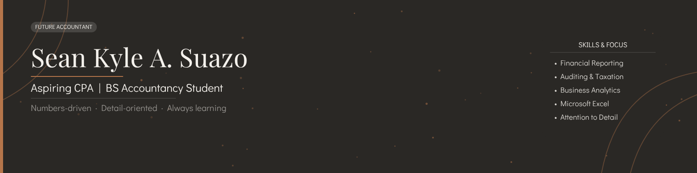
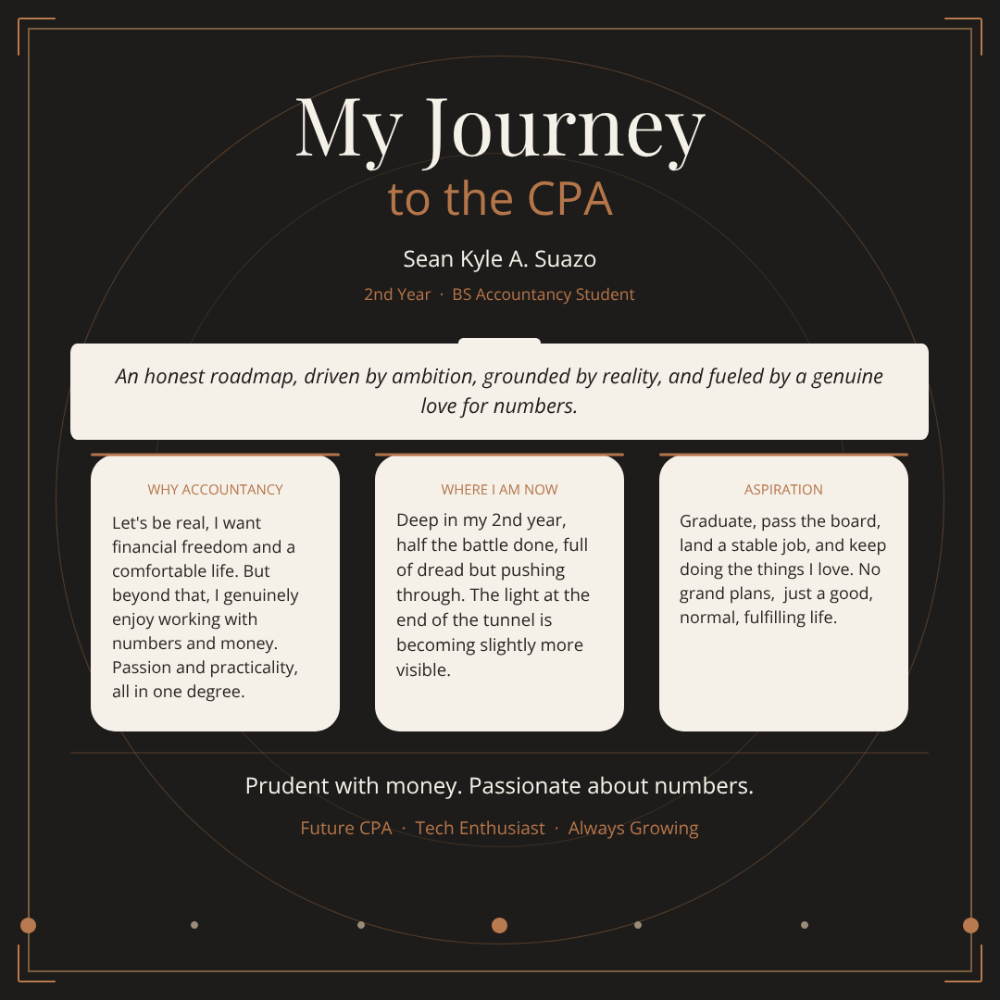
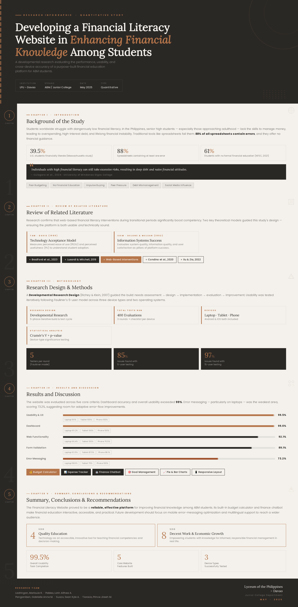

# Sean Kyle A. Suazo
### *Academic weapon with side effects*

**Bachelor of Science in Accountancy** · Ateneo de Davao University
NFJPIA | Chief Associate for Technical

> Soon to be accountant, powered by caffeine, guided by spite, and somehow still surviving. Four years of all-nighters, debits, and credits later, here we are.

---

## 🎨 Branding Kit

> *Personal identity design · Visual branding*

The branding kit is built on a 60-30-10 color rule — warm off-white (`#F4F1EC`) as the dominant base, deep charcoal (`#2A2825`) for contrast and structure, and muted terracotta (`#B5754A`) as the accent. Typography pairs **DM Serif Display** for headings with **DM Sans** for body text, keeping the layout editorial but approachable. The goal was a visual identity that reads as professional and understated while still carrying a personality behind it.
---

## 🖼️ Visuals

> *Social graphics · Banners*

**Banner**

The banner was designed to serve as a professional header across platforms, clean dark background carrying the same charcoal and terracotta palette from the branding kit, with skills listed on the right for quick scanning. Layout prioritizes readability at a glance, so the name and role land immediately without clutter.

**Poster**

The poster lays out the CPA journey in a way that's honest and personal rather than polished for the sake of it. The three-column card layout on why accountancy, where I am now, aspiration — keeps the message structured while the copy stays grounded and direct. Same branding palette maintained throughout for visual consistency.
---

## 📄 Docs

> *Infographics · Brief reports*

**Research Infographic — Financial Literacy Website Study**

This infographic visualizes a quantitative developmental research study on building a financial literacy website for ABM students, conducted at LPU Davao on my senior year. The layout follows the five-chapter research structure, from background and literature review down to conclusions, so the reader can move through the study the same way the paper unfolds. The dark palette and terracotta accent carry the same branding language throughout, keeping it visually cohesive while letting the data and statistics do the heavy lifting.
